## **Buffer Overflow en R 3.4.4**
_Documento práctico que guía la explotación completa de una vulnerabilidad real de Stack Buffer Overflow, desde la configuración del entorno hasta la ejecución controlada del exploit._

#### **Índice:**
1. [📦 PREREQUISITOS](#prerequisitos) - Herramientas esenciales y dependencias  
2. [⚙️ SETUP DEL ENTORNO](#setup-del-entorno) - Configuración completa de WinDBG y herramientas  
3. [🔎 ANÁLISIS DE LA VULNERABILIDAD](#analisis-de-la-vulnerabilidad) - Guía explicativa y recreable  
   - [PASO 0 - Configuración del debugger](#paso-0---configuracion-del-debugger)  
   - [PASO 1 - Fuzzing](#paso-1---fuzzing)  
   - [PASO 2 - Offset, localizando el EIP](#paso-2---offset-localizando-el-eip)  
   - [PASO 3 - Bad Characters](#paso-3---bad-characters)  
   - [PASO 4 - Encontrar un módulo vulnerable en el binario](#paso-4---encontrar-un-modulo-vulnerable-en-el-binario)  
   - [PASO 5 - Generar una shellcode](#paso-5---generar-una-shellcode)  
   - [PASO 6 - Explotación](#paso-6---explotacion)  
4. [📋 CONCLUSIONES TÉCNICAS](#conclusiones-tecnicas) - Validación y patrones identificados

## 📦 PREREQUISITOS <a id="prerequisitos"></a>
----
La configuración de un entorno de análisis de vulnerabilidades requiere herramientas especializadas que, aunque no forman parte del instructivo principal por su configuración predeterminada al momento de su instalación, son esenciales para la reproducibilidad del ejercicio.
#### **HERRAMIENTAS ESENCIALES**
- **Visual Studio Code** (o cualquier otro IDE u Editor de Código)
 - **Ruby 2.7+:** _Utilizado en scripts para encontrar el offset_
 - **Python 2.7.18:** _Versión compatible para la utilización de Mona en WinDBG_
 - **Python 3.9.0:** _Para ejecución de scripts de generación de shellcode_
 - **Metasploit Framework:** _Necesario durante la generación de shellcode_

## ⚙️ SETUP DEL ENTORNO <a id="setup-del-entorno"></a>
---- 
#### **INSTALACIÓN DE WinDBG x64** 
La selección de WinDBG como debugger a utilizar se debe a su capacidad nativa para análisis de memoria en sistemas Windows y su integración robusta con herramientas de explotación modernas. A diferencia de debuggers descontinuados como *Immunity Debugger*, se convierte en la opción más adecuada para análisis de vulnerabilidades en entornos Windows actuales.

**PASO A PASO**
1. **Descarga e instalación de Windows 10 SDK:**
   Descargar Windows 10 SDK (versión 10.0.17763.70.10) desde el archivo oficial de Microsoft.  [https://developer.microsoft.com/en-us/windows/downloads/sdk-archive](https://developer.microsoft.com/en-us/windows/downloads/sdk-archive)
   
2. **Selección de características a descargar:**
   Durante la instalación, marcar exclusivamente "Debugging tools for Windows" para evitar componentes innecesarios.
   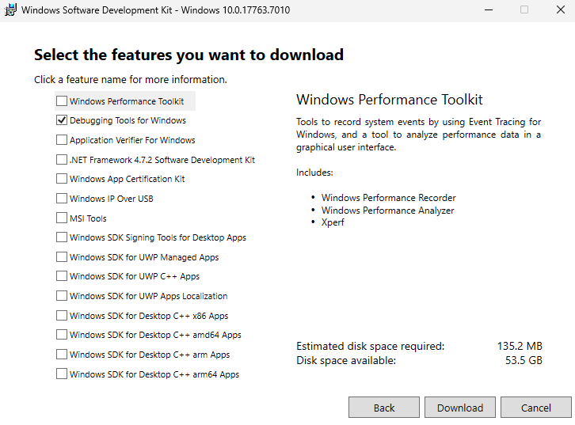
   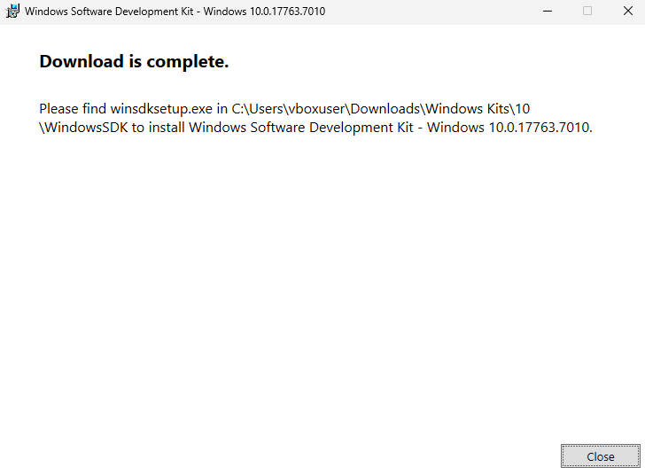

3. **Configuración de Símbolos del Sistema:**
   Crear variable de entorno (system variables)
   NOMBRE: `_NT_SYMBOL_PATH` 
   VALOR: `srv*c:\symbols*http://msdl.microsoft.com/download/symbols`
   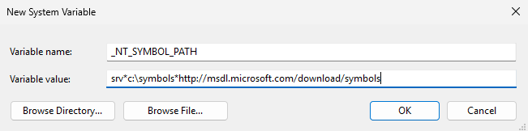
   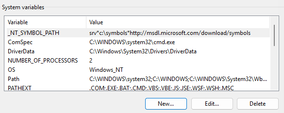

5. **Verificación de Instalación:**
	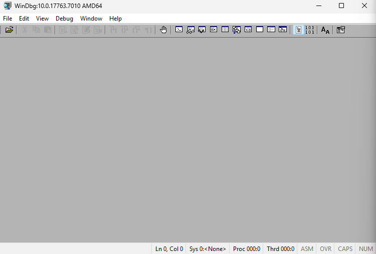
   _WinDBG instalado correctamente y listo para cargar extensiones especializadas._

#### **INTEGRACIÓN DE HERRAMIENTAS AVANZADAS**
La extensión de WinDBG con **windbglib** y **mona** proporciona capacidades automatizadas para análisis de explotación que serían prohibitivamente manuales de otra forma.

**PASO A PASO**
1. **Preparación de PyKD:**
   Descargar pykd.zip desde el repositorio oficial de **windbylib** [https://github.com/corelan/windbglib/raw/master/pykd/pykd.zip](https://github.com/corelan/windbglib/raw/master/pykd/pykd.zip)

2. **Extraer y desbloquear archivos:**
   Extraer localmente los archivos (`pykd.pyd` y `vcredist_x86.exe`) en una ubicación temporal y desbloquearlos (**unblock**) desde sus propiedades
   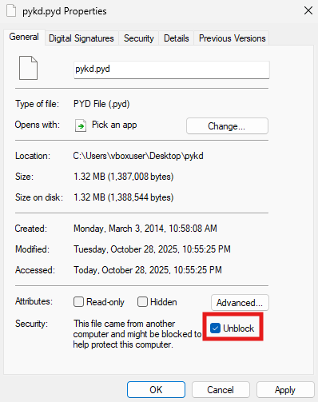

3. **Ubicar archivo `pykd.pyd`:**
   Copiar `pykd.pyd` hacia `C:\Program Files (x86)\Windows Kits\10\Debuggers\x86\winext`

4. **Instalación de Dependencias:**
   Ejecutar `vcredist_x86`, registrar msdia90.dll mediante:
```
c:  
cd "C:\Program Files (x86)\Common Files\Microsoft Shared\VC"  
regsvr32 msdia90.dll   
```
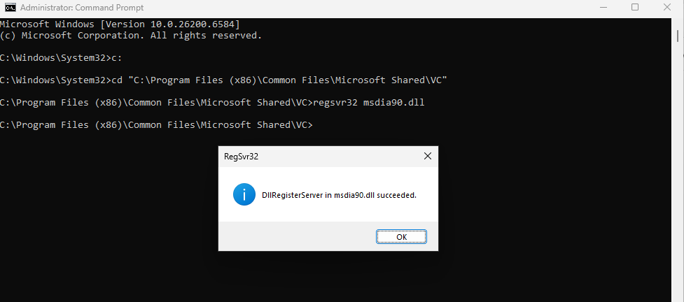

5. **Descarga de `windlib.py`:**
   Descargar `windbglib.py` desde el repositorio oficial de windbglib 
   https://github.com/corelan/windbglib/raw/master/windbglib.py
   Guardar el archivo (desbloqueado desde propiedades) bajo el path `C:\Program Files (x86)\Windows Kits\10\Debuggers\x86`
   
   _Este archivo proporciona las funciones base necesarias para la integración de Python en WinDBG_
   
6. **Descarga de `mona.py`:**
   Descargar `mona.py` desde el repositorio oficial de mona 
   https://github.com/corelan/mona/raw/master/mona.py
   Guardar el archivo (desbloqueado desde las propiedades) bajo el path `C:\Program Files (x86)\Windows Kits\10\Debuggers\x86`
   
   _Mona es la herramienta central que automatiza tareas críticas como búsqueda de ROP gadgets y análisis de memoria._
   
7. **Configuración de PyKD Bootstrapper:**
   Descargar PyKD desde el repositorio proporcionado
   https://github.com/uf0o/PyKD
   Guardar el archivo `pykd.dll` (desbloqueado desde las propiedades) bajo la ruta: `C:\Program Files (x86)\Windows Kits\10\Debuggers\x64\winext`

#### **PREPARACIÓN DEL BINARIO VULNERABLE R 3.4.4**
La selección de `R 3.4.4` como objetivo se basa en su historial conocido de vulnerabilidades y su arquitectura sin protecciones modernas, ideal para propósitos educativos.

**PASO A PASO**
1. **Descarga e Instalación:**
   Obtener el binario vulnerable R 3.4.4 desde este repositorio.
   
2. **Configuración Completa:**
   Durante la instalación, habilitar todos los componentes para asegurar la reproducibilidad del entorno vulnerable.
   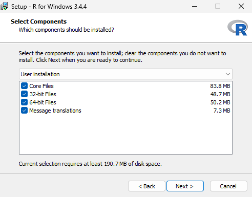

3. **Verificación del Entorno:**
   Confirmar que la aplicación ejecuta correctamente antes de iniciar el análisis de vulnerabilidades.  
   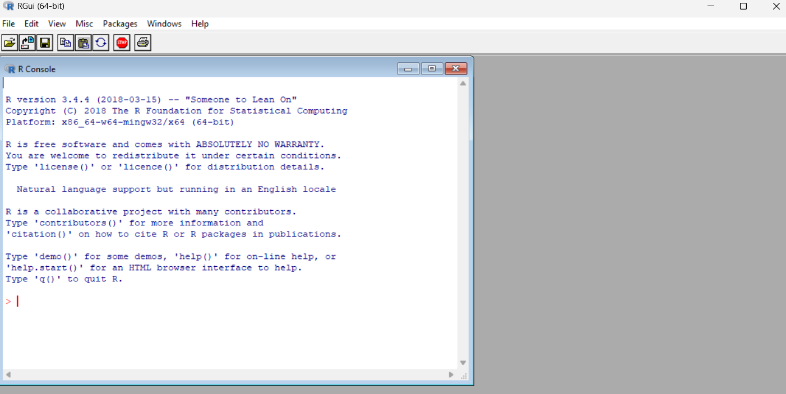


## 🔎 ANÁLISIS DE LA VULNERABILIDAD <a id="analisis-de-la-vulnerabilidad"></a>
----
#### **CONTEXTO METODOLÓGICO** 
Antes de iniciar el análisis técnico, es crucial entender que seguimos una metodología estructurada de **Análisis de Vulnerabilidades** que consiste en: Reconocimiento, Fuzzing, Desarrollo de Exploit y Validación. Cada fase tiene objetivos específicos y herramientas especializadas.

### **PASO 0 - Configuración del debugger:** <a id="paso-0---configuracion-del-debugger"></a>
La configuración del debugger es fundamental para un análisis exitoso. WinDBG, será la herramienta que nos proporcione visibilidad completa sobre el estado interno de la aplicación durante la explotación, permitiéndonos:
- Monitorear registros de CPU
- Analizar el estado de la memoria durante el crash
- Identificar direcciones de retorno y punteros críticos

**PASO A PASO**
1. **Carga del Binario Vulnerable**: 
   Desde el debugger WinDBG x64, abrir el ejecutable `R 3.4.4`, correspondiente al binario vulnerable a evaluar.  
   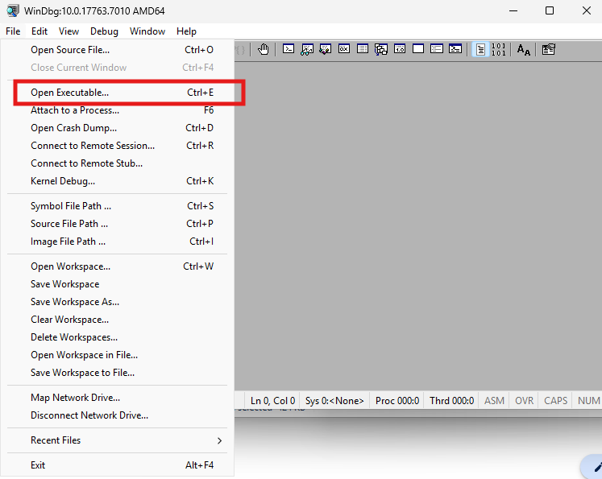
   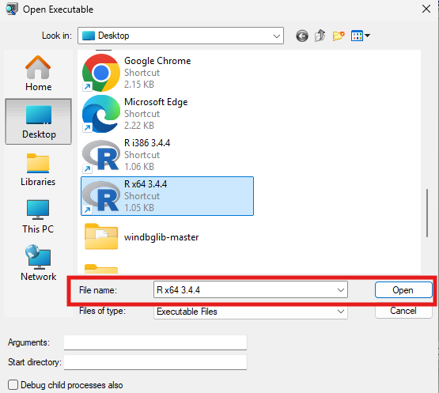
   _Este paso establece el entorno controlado donde observaremos el comportamiento de la aplicación bajo condiciones de explotación._
   

2. **Configuración de Vistas Esenciales:**
   Configuramos las pestañas críticas para nuestro análisis:
   - **Registers**: Para monitorizar EIP, ESP, EBP y otros registros vitales
   - **Command**: Para ejecutar comandos de Mona y análisis en tiempo real
   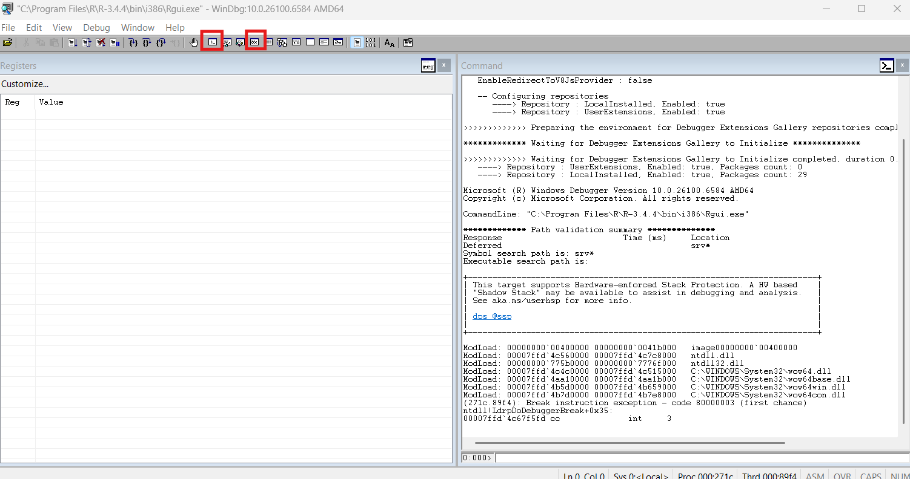

3. **Ejecución Controlada del Programa:**
   Iniciamos la aplicación dentro del debugger manteniendo el control sobre su ejecución.
   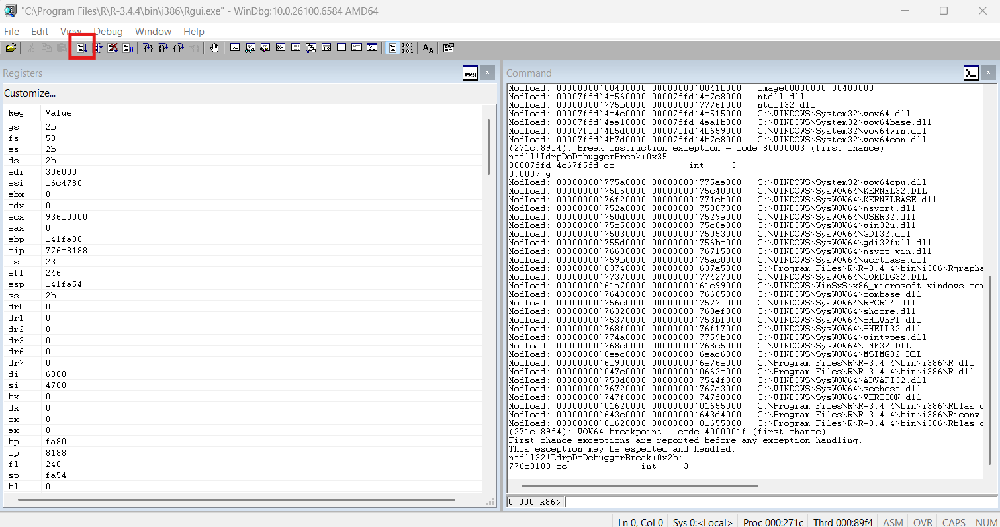
   _El programa ahora ejecuta bajo nuestro supervisión, listo para interceptar y analizar el crash cuando ocurra._

### **PASO 1 - Fuzzing:** <a id="paso-1---fuzzing"></a>
El fuzzing sistemático nos permite identificar puntos de entrada no sanitizados que puedan lead a corrupción de memoria. Buscamos específicamente:
- Inputs que no validan longitud de buffers
- Parsers que no manejan caracteres especiales
- Funciones que copian datos sin verificación

**PASO A PASO**
1. **Identificación del Campo Vulnerable:**
	Ruta: _Edit_ → _GUI Preferences → Language for menus and messages_
	El textfield presente podría tener sanitización insuficiente, siendo susceptible a una vulnerabilidad. Por ello, será puesto a prueba de sobreescritura al manejar gran cantidad de datos (Fuzzing)
	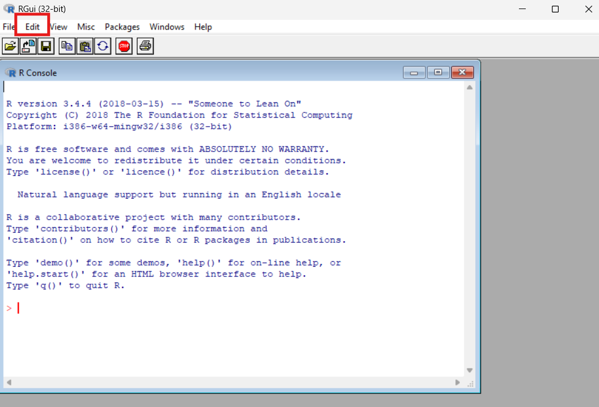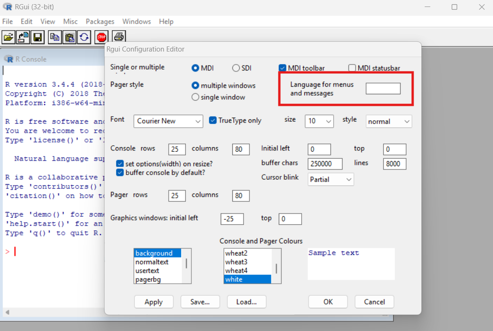
	
2. **Patrón de prueba:**
   `print("A"*1000)`
   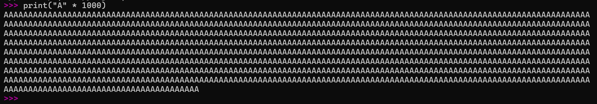
   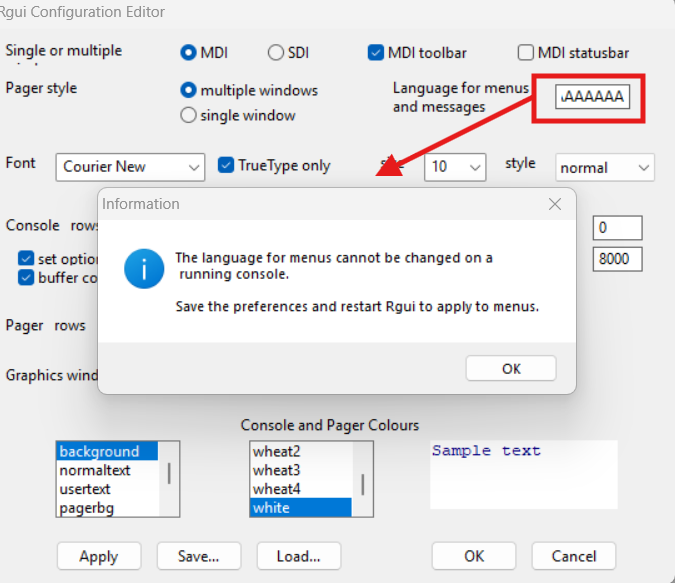
   _Utilizamos el mismo carácter repetidamente para provocar un crash por sobreescritura de stack. El carácter 'A' (0x41 en hexadecimal) es ideal para esta prueba inicial ya que es fácilmente identificable en memoria._
   
3. **Validación del Crash:**
   El debugger confirma la vulnerabilidad de **buffer overflow** al mostrar registros críticos sobrescritos con nuestro patrón de "A"s (0x41 en hexadecimal). El EIP, que normalmente contiene la dirección de retorno legítima, ahora apunta a 0x41414141, demostrando que controlamos el flujo de ejecución.. 
   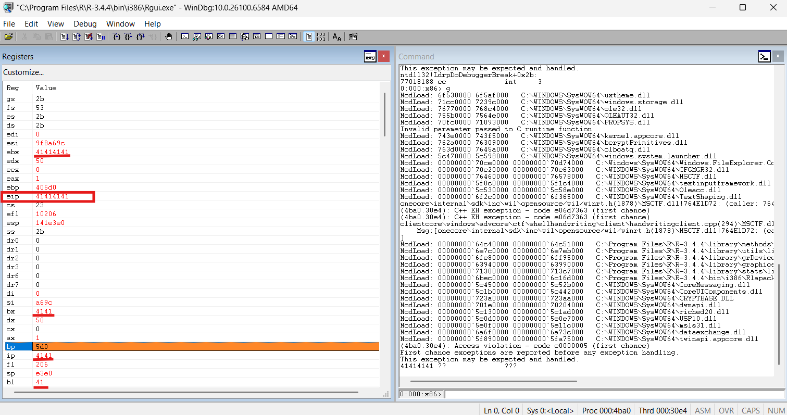


### **PASO 2 - Offset, localizando el EIP:** <a id="paso-2---offset-localizando-el-eip"></a>
Controlar el EIP (Instruction Pointer) es crucial para redirigir el flujo de ejecución. El offset nos indica la posición exacta donde podemos sobreescribir la dirección de retorno.

**PASO A PASO**
1. **Generación de Patrón Único:**
   Ejecución del script `pattern_create.rb` (descargado desde este propio repositorio)
   `ruby pattern_create.rb -l 1000` 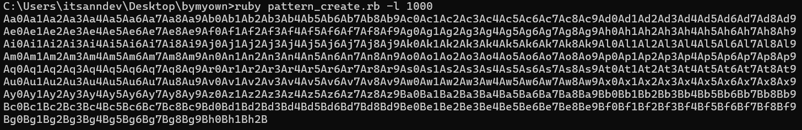
   _Este patrón único actúa como "huella dactilar" en memoria. Al sobreescribir el EIP con una secuencia específica de este patrón, podemos calcular exactamente cuántos bytes necesitamos para alcanzar la dirección de retorno._
   
2. **Inyección y Análisis del Crasheo**
   EIP: `6a41376a`
   Este valor representa una posición específica en nuestro patrón
   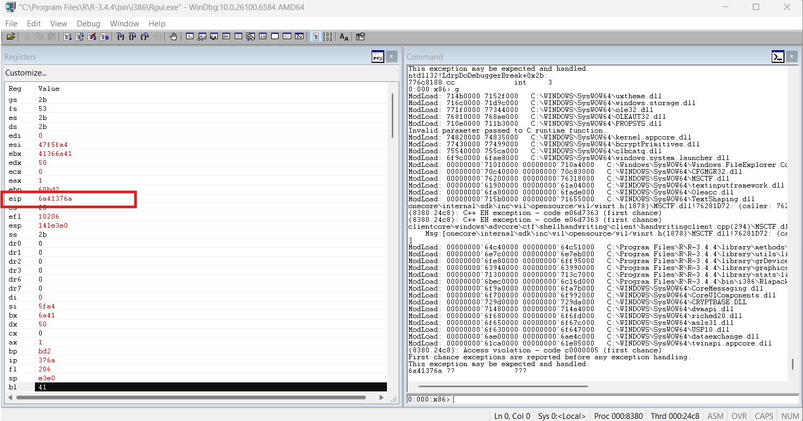

3. **Cálculo del Offset Exacto**
   Ejecución del script `pattern_offset.rb` (descargado desde este propio repositorio)
   `ruby pattern_offset.rb -l 10000 -q 6a41376a`
   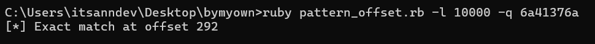
   _Debes tener en consideración que le parámetro `-q` debe corresponder al EIP del crasheo._
   
   Posterior a su ejecución, descubrimos que el **offset** se encuentra en la posición **292**.

### **PASO 3 - Bad Characters:** <a id="paso-3---bad-characters"></a>
Ciertos caracteres pueden truncar o corromper nuestro payload durante la copia en memoria. Identificarlos es esencial para generar shellcode efectivo.

**PASO A PASO**
1. **Configuración del Entorno de Análisis
   `!py mona config -set workingfolder PATH`  
   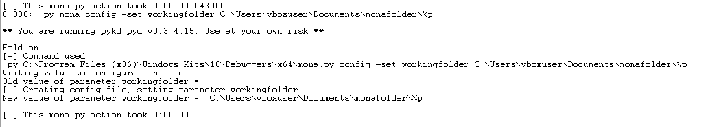
   _Esto permite establecer una carpeta de trabajo (workspace) para la exportación de archivos .txt y .bin de posterior uso durante el análisis._
   
2. **Generación de Bytearray de Referencia:**
   `!py mona bytearray`
   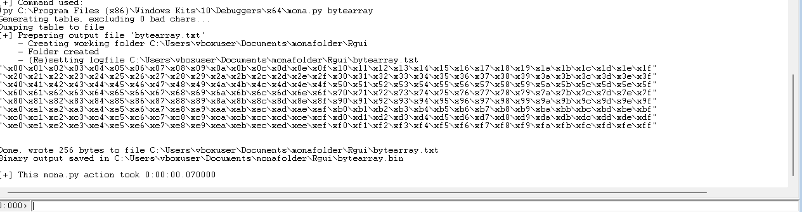
   _Generamos una secuencia completa de bytes (0x00-0xFF) que servirá como referencia para identificar caracteres problemáticos durante la copia en memoria.

3. **Análisis Comparativo Post-Crash:**
   `!py mona compare -f PATH-CARPETA-TRABAJO-MONA\bytearray.bin -a VALOR-ESP`
   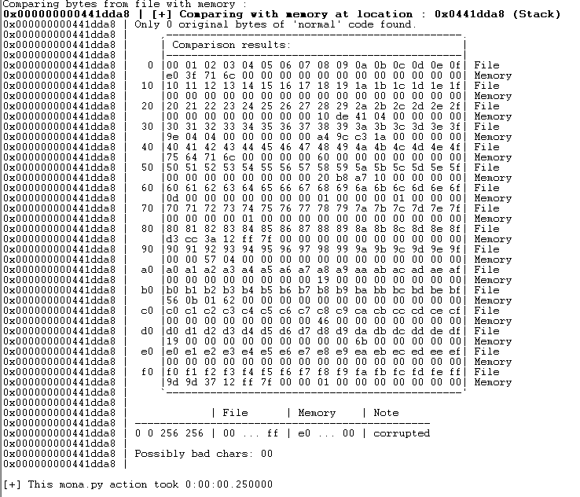
   *Comparamos el contenido actual de la memoria (apuntado por ESP) con nuestro bytearray de referencia. Los caracteres modificados o truncados indican "bad characters" que deben ser excluidos del shellcode final.*

4. **Validación Iterativa:**
   `!py mona bytearray -b "\x00"`
   Eliminamos el bad character identificado y generamos un nuevo bytearray. Este proceso iterativo continúa hasta que la comparación muestre "unmodified", indicando que todos los caracteres restantes son seguros.
   
   
5. **Confirmación Final:**
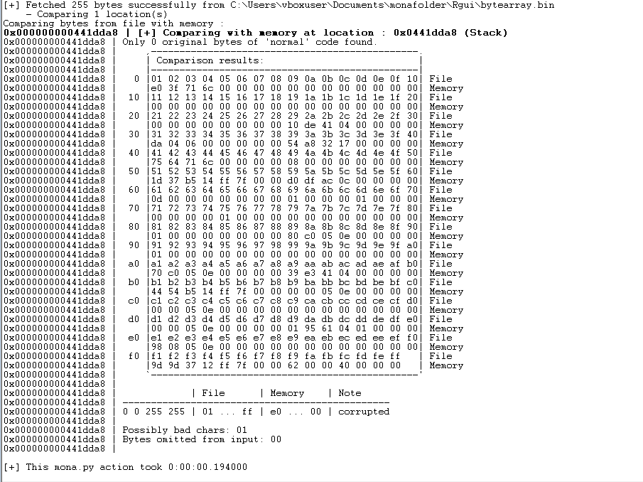
   _Tras eliminar \x00, el análisis comparativo muestra "unmodified", confirmando que hemos identificado todos los bad characters que podrían truncar nuestro shellcode._
   
### **PASO 4 - Encontrar un módulo vulnerable en el binario** <a id="paso-4---encontrar-un-modulo-vulnerable-en-el-binario"></a>
Necesitamos un módulo con direcciones estables y sin protecciones (ASLR, DEP) para alojar nuestro payload

**PASO A PASO**
1. **Listar Módulos**:
   `!py mona modules`
   
2. **Evaluar módulos disponibles según el criterio de selección:**
   Considerando que nuestro objetivo es encontrar un módulo sin las médidas preventivas adecuadas, el módulo objetivo debe contar con cada valor de la tabla en negativo o **falso**. (Rebase: _False_, SafeSEH: _False_, ASLR: _False_, CFG: _False_, OS Dll: _False_)
   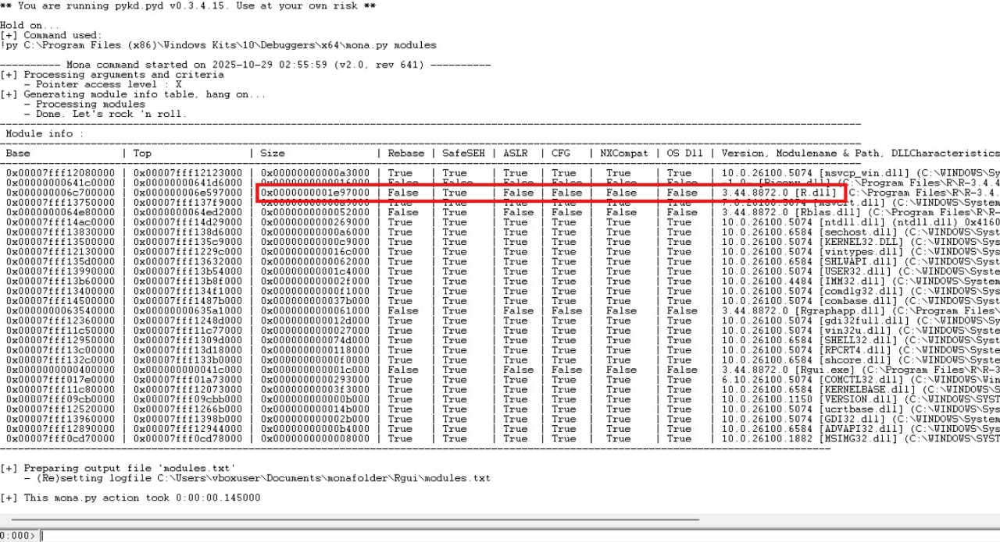
   
3. **Selección del módulo:**
   Módulo vulnerable encontrado: `R.dll`
   
4. **Búsqueda de Instrucción JMP ESP:**
   `!py mona find -s "\xff\xe4" -m R.dll` 
   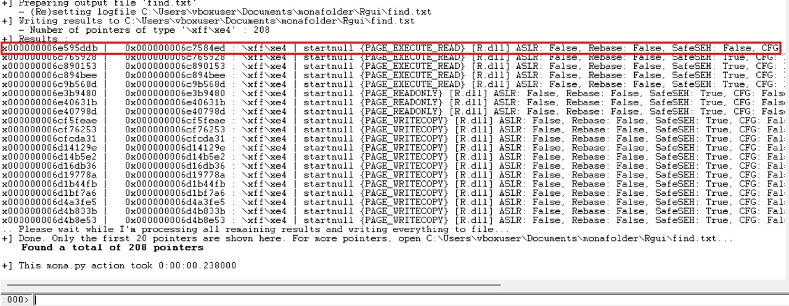 
   Buscamos específicamente la instrucción **JMP ESP** (código máquina `\xFF\xE4`) dentro del módulo R.dll. Esta instrucción funciona como nuestro **punto de redirección crítico**: cuando el flujo de ejecución sobreescriba el EIP con esta dirección, el procesador ejecutará un salto al registro ESP, que apunta directamente al inicio de nuestro buffer en el stack. Aquí es donde hemos posicionado cuidadosamente nuestro shellcode, creando así una transición perfecta desde el desbordamiento controlado hacia la ejecución de nuestro payload.
   
   _Resultado: `0x6e595ddb` (JMP ESP en R.dll - dirección en little-endian: `\xdb\x5d\x59\x6e`)_

### **PASO 5 - Generar una shellcode** <a id="paso-5---generar-una-shellcode"></a>
La shellcode debe ser compatible con el entorno y evadir detección mientras ejecuta nuestra carga útil, en este caso, pretendemos la elaboración de la shellcode bajo un criterio simple, la ejecución de la calculadora nativa del sistema.

**PASO A PASO**
1. **Generación con MSFVenom:**
   `msfvenom -a x86 — platform Windows -p windows/exec cmd=calc.exe -e x86/alpha_upper  -f c`
   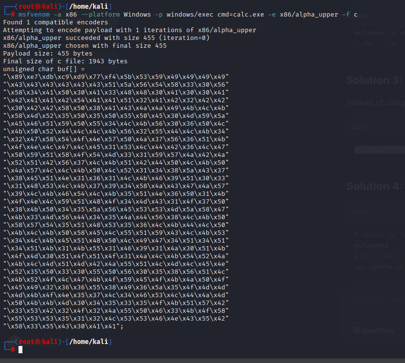
   _Utilizamos el encoder `alpha_upper` para generar shellcode que contenga solo caracteres alfanuméricos en mayúsculas, evitando así problemas con caracteres especiales que podrían truncar nuestro payload._

2.  **Adjuntar Shellcode al Script Destinado para la Explotación:**
   Es necesario reemplazar el contenido de la shellcode generado, en el script `shellcode.py`, descargado desde este propio repositorio
   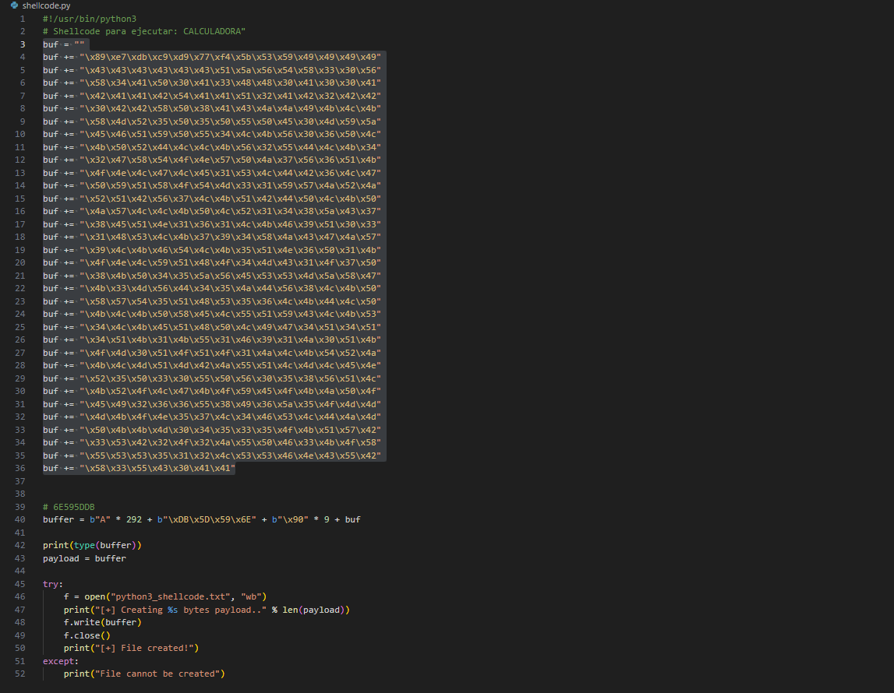

3. **Ejecutar el script  `shellcode.py`:** 
   desde una cmd. Si resulta exitoso, un archivo .txt de nombre python3_shellcode será generado bajo el mismo directorio.


### **PASO 6 - Explotación** <a id="paso-6---explotacion"></a>
Esta etapa demuestra en práctica que el fallo de seguridad tiene un riesgo de ser materializado, mostrando un control efectivo sobre el binario vulnerable que debe ser documentado, investigado y parcheado con posterioridad.

**INSTRUCCIÓN**
1. **Adjuntar contenido del payload en el input vulnerable:** 
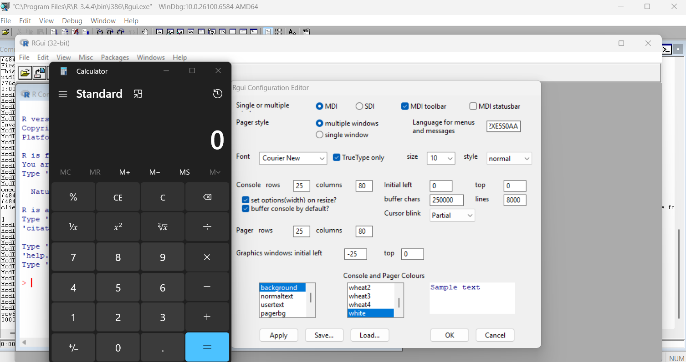
Si se han seguido los pasos de manera correcta, el input proporcionado redirecciona las instrucciones del programa a la shellcode, el cual contiene un payload específico para abrir la calculadora del sistema. Esto comprueba que la explotación ha sido exitosa.

## 📋 CONCLUSIONES TÉCNICAS <a id="conclusiones-tecnicas"></a>
----
**VALIDACIÓN DEL EXPLOIT:**
- Control de EIP conseguido
- Redirección a shellcode exitosa
- Bad characters omitidos
- Payload ejecutado sin crashes
- Calculator.exe lanzada exitosamente

**PATRONES IDENTIFICADOS:
- **Validación de Inputs Insuficiente:** El parser de localizaciones no verifica longitud
- **Manejo de Memoria Inseguro:** Uso de funciones de copia sin verificación de límites
- **Protecciones Críticas Deshabilitadas:** Módulos sin ASLR/DEP/SafeSEH
- **Control de Ejecución Predecible:** Direcciones de memoria estáticas que facilitan la explotación

**METODOLOGÍA VALIDADA:
- Identificacion precisa de superficies de ataque
- Desarrollo controlado de exploits
- Documentación reproducible para otros analistas


